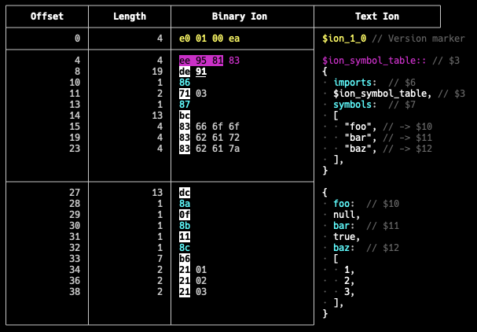
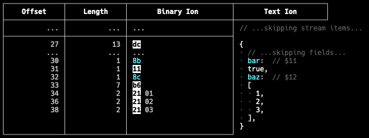
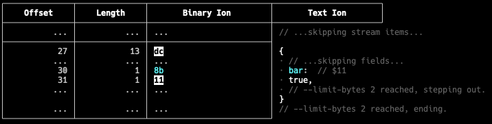

# `ion-cli`

This repository is home to the `ion` command line tool, which provides subcommands
for working with [the Ion data format](https://amzn.github.io/ion-docs/docs/spec.html).

## Table of contents

* [Examples](#examples)
    * [Viewing the contents of an Ion file](#viewing-the-contents-of-an-ion-file)
    * [Converting between Ion formats](#converting-between-ion-formats)
    * [Converting between Ion and other formats with `to` and `from`](#converting-between-ion-and-other-formats-with-to-and-from)
    * [Analyzing binary Ion file encodings with `inspect`](#analyzing-binary-ion-file-encodings-with-inspect)
* [Installation](#installation)
    * [via `brew`](#via-brew)
    * [via `cargo`](#via-cargo)
* [Build Instructions](#build-instructions)
    * [From source](#from-source)
    * [Using Docker](#using-docker)

## Examples

These examples use the `.ion` file extension for text Ion and the `.10n` file
extension for binary Ion. This is simply a convention; the tool does not
evaluate the file extension.

Unless otherwise noted, these commands can accept any Ion format as input.

### Viewing the contents of an Ion file

The `ion cat` command reads the contents of the specified files (or `STDIN`) sequentially
and writes their content to `STDOUT` in the requested Ion format.

```shell
ion cat my_file.ion
```

You can use the `--format`/`-f` flag to specify the desired format. The supported formats are:

* `pretty` - Generously spaced, human-friendly text Ion. This is the default.
* `text` - Minimally spaced text Ion.
* `lines` - Text Ion that places each value on its own line.
* `binary`- Binary Ion

### Converting between Ion formats

Convert Ion text (or JSON) to Ion binary:

```shell
ion cat --format binary my_text_file.ion -o my_binary_file.ion 
```

Convert Ion binary to generously-spaced, human-friendly text:

```shell
ion cat --format pretty my_binary_file.ion -o my_text_file.ion 
```

Convert Ion binary to minimally-spaced, compact text:

```shell
ion cat --format text my_binary_file.ion -o my_text_file.ion 
```

### Converting between Ion and other formats with `to` and `from`

The `beta to` and `beta from` commands can convert Ion to and from other formats.
Currently, JSON is supported.

Convert Ion to JSON:

```shell
ion beta to json my_file.10n
```

Convert JSON to Ion:

```shell
ion beta from json my_file.json
```

### Analyzing binary Ion file encodings with `inspect`

The `inspect` command can display the hex bytes of a binary Ion file alongside
the equivalent text Ion for easier analysis.

```shell
# Write some text Ion to a file
echo '{foo: null, bar: true, baz: [1, 2, 3]}' > my_file.ion

# Convert the text Ion to binary Ion
ion cat --format binary my_file.ion > my_file.10n

# Show the binary encoding alongside its equivalent text 
ion inspect my_file.10n
```



----
**The `--skip-bytes` flag**

To skip to a particular offset in the stream, you can use the `--skip-bytes` flag.

```shell
ion inspect --skip-bytes 30 my_file.10n
```



Notice that the text column adds comments indicating where data has been skipped.
Also, if the requested index is nested inside one or more containers, the beginnings
of those containers (along with their lengths and offsets) will still be included
in the output.

-----
**The `--limit-bytes` flag**

You can limit the amount of data that `inspect` displays by using the `--limit-bytes`
flag:

```shell
ion inspect --skip-bytes 30 --limit-bytes 2 my_file.10n
```



### Schema subcommands

All the subcommand to load or validate schema are under the `beta schema` subcommand.

To load a schema:

```bash
ion beta schema load --directory <DIRECTORY> --schema <SCHEMA_FILE> 
```

To validate an ion value against a schema type:

```bash
ion beta schema validate --directory <DIRECTORY> --schema <SCHEMA_FILE> --input <INPUT_FILE> --type <TYPE>
```

For more information on how to use the schema subcommands using CLI, run the following command:

```bash
ion beta schema help  
```

## Installation

### via `brew`

The easiest way to install the `ion-cli` is via [Homebrew](https://brew.sh/).

Once the `brew` command is available, run:

```bash
brew tap amazon-ion/ion-cli
brew install ion-cli
```

### via `cargo`

The `ion-cli` can also be installed by using Rust's package manager, `cargo`.
If you don't already have `cargo`, you can install it by visiting
[rustup.rs](https://rustup.rs/).

To install `ion-cli`, run the following command:

```shell
cargo install ion-cli
```

Then make sure that `~/.cargo/bin` is on your `$PATH`. You can confirm that it
has been installed successfully by running:

```shell
ion help
```

You should see output that resembles the following:

```
A collection of tools for working with Ion data.

Usage: ion [OPTIONS] <COMMAND>

Commands:
  beta     The 'beta' command is a namespace for commands whose interfaces are not yet stable.
  cat      Prints all Ion input files to the specified output in the requested format.
  head     Prints the specified number of top-level values in the input stream.
  inspect  Displays hex-encoded binary Ion alongside its equivalent text Ion.
               Its output prioritizes human readability and is likely to change
               between versions. Stable output for programmatic use cases is a
               non-goal.
  help     Print this message or the help of the given subcommand(s)

Options:
      --no-auto-decompress  Turn off automatic decompression detection.
  -h, --help                Print help
  -V, --version             Print version
```

## Build instructions

### From source

1. Clone the repository:
   ```
   git clone https://github.com/amzn/ion-cli.git
   ```

2. Step into the newly created directory:
   ```
   cd ion-cli
   ```

3. Install Rust/Cargo [by visiting rustup.rs](https://rustup.rs/).

4. Build the `ion` tool:
   ```
   cargo install --path .
   ```
   This will put a copy of the `ion` executable in `~/.cargo/bin`.

5. Confirm that `~/.cargo/bin` is on your `$PATH`. `rustup` will probably take care of this for you.

6. Confirm that the executable is available by running:
   ```
   ion help
   ```

### Using Docker

1. Install Docker (see OS specific instructions on the [Docker website](https://docs.docker.com/get-docker/))
2. Clone the repository (recursive clone not necessary)
   ```
   git clone https://github.com/amzn/ion-cli.git
   ```
3. Step into the newly created directory
   ```
   cd ion-cli
   ```
4. Build and run the image
   ```
   # build the image
   docker build -t <IMAGE_NAME>:<TAG> .


   # run the CLI binary inside the Docker image
   docker run -it --rm [optional flags...] <IMAGE_NAME>:<TAG> ion <SUBCOMMAND>

   # examples:

   # build docker image with current release version
   docker build -t ion-cli:0.1.1 .

   # print the help message
   docker run -it --rm ion-cli:0.1.1 ion -V

   # mount current directory to /data volume and cat an ion file
   docker run -it --rm -v $PWD:/data ion-cli:0.1.1 ion cat /data/test.ion

   ```

## Security

See [CONTRIBUTING](CONTRIBUTING.md#security-issue-notifications) for more information.

## License

This project is licensed under the Apache-2.0 License.
